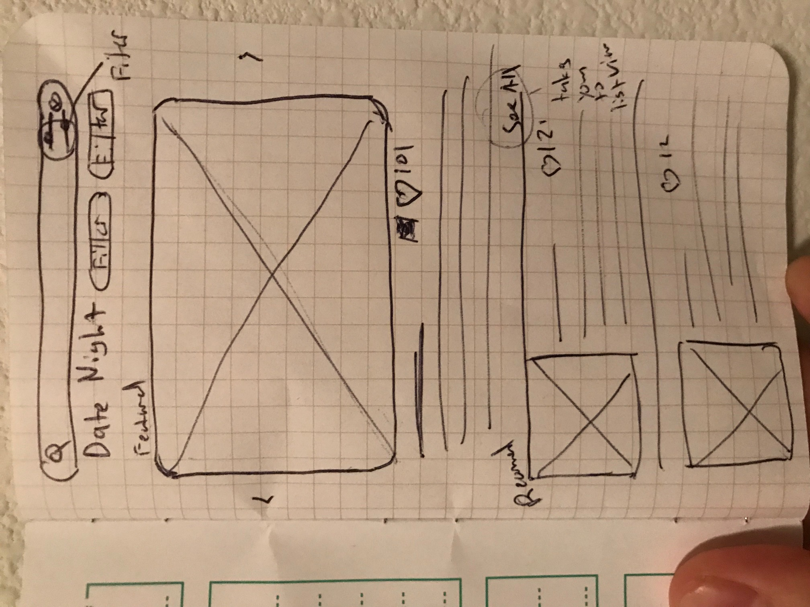

# Date Night Design Documentation

A on-going list of features and design decissions.

# Features

* Discovery
    * Date Night Feed
    * Searchable by tags
    * Searchable by geo-location
    * Able to add favorite Date Nights
    * Should be able to record Dates that I select and end up going
    * Should be able to rate Date Nights

    

* Creation
    * Easy editor
    * Should be able to record imgs, text, gifs, and maybe sound
    * Should have a varity of travel methods
    * Use check in methods to go from one date node to antoher
    * Date Nights should have a duration estimation
    * Should be able to share Date Nights to social media / via text and other means
    * Not MVP but should be able to edit a Date Night with significant other or multiple parties

     
* User Features
    * User should be able to select a Date Night Template and then edit it to their liking and the system should provide alternatives
    * View Favorited Date Nights
    * View own Date Night History
    * Should have one active Date Night at a time that will expire after the Date Night time period ends
    * Can add notes and edit your current Date Night e.a. the idea of forking the Date Night and making edits
    * Review mode should allow users to mark which part of the Date Night they actually went to and be able to review the entire Date Night or each part in particular
    * Instagram ingration to create stories of your date night at the end of the Date Night
    * Not MVP but should be able to book restraunts and lifts directly from the app
    * Iternary mode for active date only

     

# Tech Design Documentation

## Frontend - Web: 

The Front end web page will serve as a landing page and also have all of the features except iternary. Web would be the ideal place for users
to do their discovery and also planning

I had thoughts on using relay here with graphql but didn't feel like it.

* React / Redux
* Standard Web tech ~_~

## Backend API:

I had thoughts about using graphql and serverless here, but didn't feel like it.
Plus with Python 3.6 i'm curious about its support for types

* Django - Python 

## Mobile Client:

I want to use native languages for both iOS and Android.

* iOS - Swift
* Android - Kotlin

## DevOps:

Might as well get a good use out of my AWS certifcation hehe

* AWS

## Git Workflow:

* push to master

# MVP

my MVP is to create a working iOS app with a working backend.
    * A user should be able to discover a new Date
    * A user should be able to create a new Date
    * A user should be able to go on a Date and mark it as complete
    * A user should be able to review their Date Night history

# Milestones

- [ ] Backend MVP
- [ ] iOS Client MVP
- [ ] Web Client MVP
- [ ] MVP Alpha Lanuch
- [ ] Android Client MVP
- [ ] Get bought out!!!$$$$$!!$$$